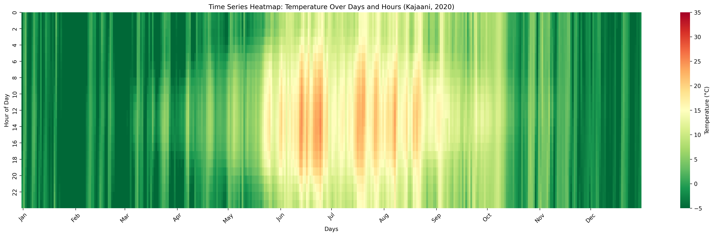

# Experiments with green computing data
## Data about climate
When we can select location of a datacenter, it's the first option. Temperatures in Czech region around Prague ([Jupyter notebook](/examples/ERA5-temperature.ipynb))
 and in Findland (LUMI in Kajaani).  The temperatures are displayed on the same scale with external values included in the max and min values, so all days under -5 are counted in the most dark color.

## Carbon intensity of electricity

## Workload CPU intensity

# How-to work with FAIR data repositories
## Get selected data from the repository
* Select and download particular file (or files) from given dataset - [HERE - second cell of the notebook](/examples/ERA5-temperature.ipynb) is an example using Zenodo API via requests.
