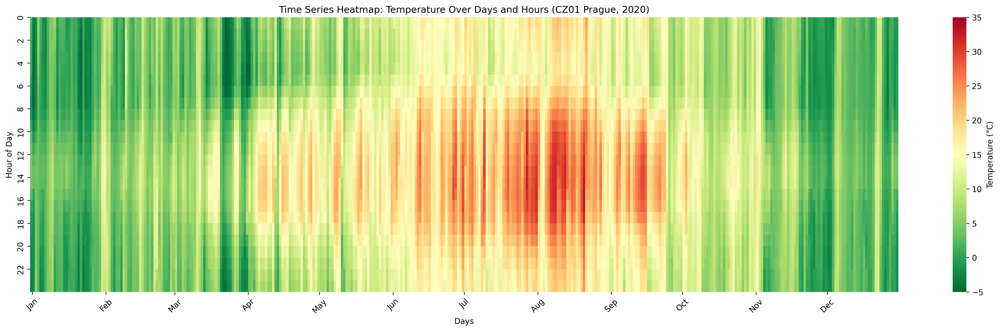

# Experiments with green computing data
## Data about climate
When we can select location of a datacenter, it's easy. Temperatures in Czech region around Prague ([Jupyter notebook](/examples/ERA5-temperature.ipynb))

## Carbon intensity of electricity

## Workload CPU intensity

# How-to work with FAIR data repositories
## Get selected data from the repository
